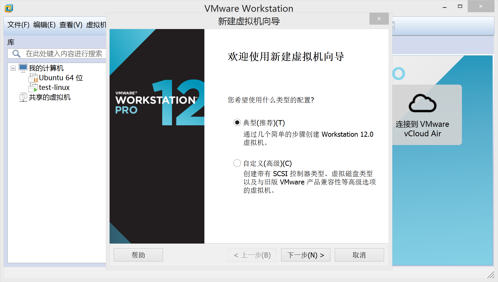
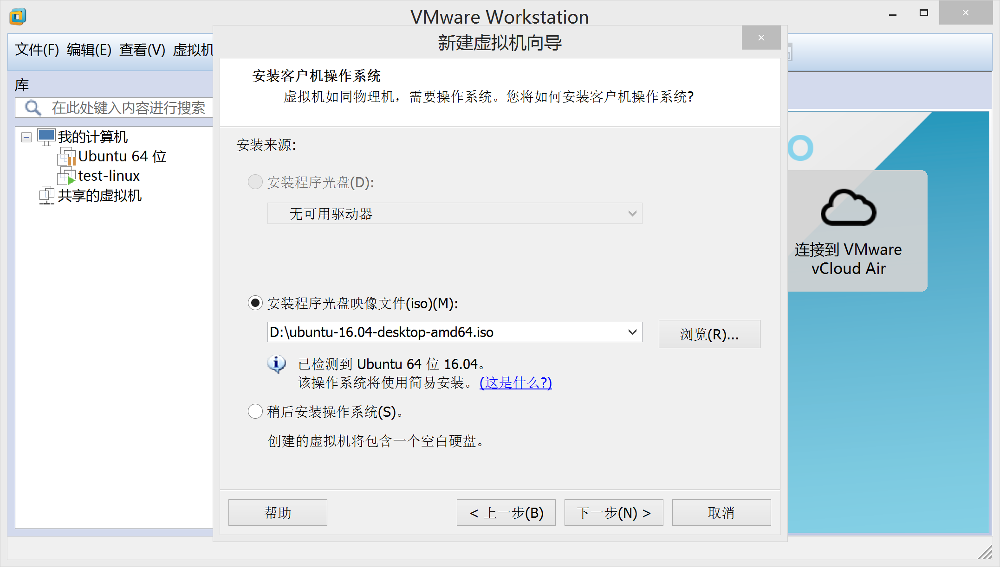

## Linux 安装
由于考虑到大部分同学使用的操作系统是Windows或mac os,为了方便以及节省时间,我们这里推荐
安装虚拟机的方式来使用Linux.

### Linux虚拟机安装
Linux虚拟机需要虚拟机软件和操作系统的镜像。比较常用的虚拟机例如VMWare，大家可以去搜索一下来安装，这个具体步骤不做赘述。
操作系统我们这里使用Ubuntu，不过大家也可以选择CentOS,不过学习的时候会有一些命令有差异等等。
Ubuntu的下载可以前往官网 https://www.ubuntu.com/download 下载Desktop版的iso镜像。

下载完后打开虚拟机（这里以VMware为例），如图。

选择创建新的虚拟机，直接选择典型即可。

下一步后选择光盘映像文件，导入已经下载好的ubuntu映像。

这一步填入你希望的信息。

下一步填入虚拟机名称和位置等等。之后设置一下分配的空间大小等等。如果没有特殊需要的话基本可以一路下一步。

之后会打开虚拟机，开始ubuntu安装，这需要一段时间。
安装后输入之前设定的密码登入，ok。

在这个虚拟机下你可以随便看一看玩一玩。

不过我们终归还是要和命令行打交道。Ctrl+Alt+F1进入命令行。
输入你的用户名和密码登录。注意这里密码是不会显示星号什么的。登入后这就是命令行的界面。
